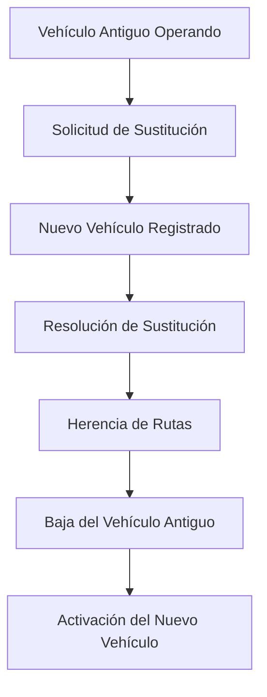

# 🔄 Lógica de Sustitución de Vehículos

## 🎯 **Concepto de Sustitución**

La **sustitución de vehículos** es un proceso administrativo donde un vehículo nuevo reemplaza a un vehículo existente, heredando sus autorizaciones y rutas, mientras el vehículo anterior es dado de baja.

## 📋 **Casos de Uso Comunes**

### 1️⃣ **Sustitución por Antigüedad**
- **Escenario**: Vehículo de 1995 debe ser reemplazado por normativa
- **Proceso**: Nuevo vehículo 2024 sustituye al antiguo
- **Resultado**: Nuevo vehículo hereda rutas, antiguo se da de baja

### 2️⃣ **Sustitución por Accidente**
- **Escenario**: Vehículo sufre accidente total
- **Proceso**: Empresa adquiere vehículo de reemplazo
- **Resultado**: Continuidad del servicio con nuevo vehículo

### 3️⃣ **Sustitución por Mejora Tecnológica**
- **Escenario**: Empresa moderniza su flota
- **Proceso**: Vehículos nuevos reemplazan a los existentes
- **Resultado**: Mejora del servicio manteniendo autorizaciones

## 🔧 **Campos del Modelo de Sustitución**

### **Campos Agregados al Vehículo**
```python
class Vehiculo(BaseModel):
    # ... campos existentes ...
    
    # Campos de sustitución
    placaSustituida: Optional[str] = None          # Placa del vehículo sustituido
    fechaSustitucion: Optional[datetime] = None    # Fecha de la sustitución
    motivoSustitucion: Optional[MotivoSustitucion] = None  # Motivo
    resolucionSustitucion: Optional[str] = None    # Resolución que autoriza
```

### **Enum de Motivos de Sustitución**
```python
class MotivoSustitucion(str, Enum):
    ANTIGUEDAD = "ANTIGÜEDAD"                    # Por año de fabricación
    ACCIDENTE = "ACCIDENTE"                      # Por accidente o siniestro
    CAMBIO_TITULARIDAD = "CAMBIO_TITULARIDAD"    # Por cambio de propietario
    SUSTITUCION_VOLUNTARIA = "SUSTITUCIÓN_VOLUNTARIA"  # Sustitución por mejora
    MANTENIMIENTO_MAYOR = "MANTENIMIENTO_MAYOR"  # Por mantenimiento extenso
    NORMATIVA = "NORMATIVA"                      # Por cambios normativos
    OTROS = "OTROS"                              # Otros motivos
```

## 🔄 **Proceso de Sustitución**

### **Flujo Completo**


### **Pasos Detallados**

#### **1. Registro del Vehículo Sustituto**
```python
vehiculo_nuevo = VehiculoCreate(
    placa="XYZ-456",
    empresaActualId="1",
    placaSustituida="ABC-123",           # Vehículo que sustituye
    motivoSustitucion=MotivoSustitucion.ANTIGUEDAD,
    resolucionSustitucion="R-1005-2024",
    fechaSustitucion=datetime.utcnow(),
    # ... otros campos ...
)
```

#### **2. Procesamiento Automático**
```python
async def procesar_sustitucion(vehiculo_nuevo_id, placa_sustituida, motivo, resolucion):
    # 1. Buscar vehículo sustituido
    vehiculo_antiguo = await get_vehiculo_by_placa(placa_sustituida)
    
    # 2. Dar de baja vehículo antiguo
    vehiculo_antiguo.estado = EstadoVehiculo.DADO_DE_BAJA
    vehiculo_antiguo.estaActivo = False
    
    # 3. Heredar rutas al vehículo nuevo
    vehiculo_nuevo.rutasAsignadasIds = vehiculo_antiguo.rutasAsignadasIds.copy()
    
    # 4. Registrar sustitución
    vehiculo_nuevo.placaSustituida = placa_sustituida
    vehiculo_nuevo.fechaSustitucion = datetime.utcnow()
```

## 📊 **Validaciones Implementadas**

### **En Carga Masiva desde Excel**
```python
# Si hay placa sustituida, validar:
if placa_sustituida:
    # 1. Formato de placa válido
    if not validar_formato_placa(placa_sustituida):
        errores.append("Formato de placa sustituida inválido")
    
    # 2. Vehículo sustituido existe
    vehiculo_sustituido = buscar_vehiculo(placa_sustituida)
    if not vehiculo_sustituido:
        advertencias.append("Vehículo no encontrado para sustitución")
    
    # 3. Motivo es requerido
    if not motivo_sustitucion:
        errores.append("Motivo de sustitución requerido")
    
    # 4. Resolución es requerida
    if not resolucion_sustitucion:
        errores.append("Resolución de sustitución requerida")
    
    # 5. Formato de resolución válido
    if not validar_formato_resolucion(resolucion_sustitucion):
        errores.append("Formato de resolución inválido")
```

### **Validaciones de Negocio**
- ✅ **Placa única**: El vehículo sustituto no puede tener la misma placa que el sustituido
- ✅ **Empresa coherente**: Ambos vehículos deben pertenecer a la misma empresa
- ✅ **Fecha lógica**: La fecha de sustitución debe ser posterior al registro del vehículo antiguo
- ✅ **Resolución válida**: La resolución de sustitución debe existir y estar vigente
- ✅ **Estado coherente**: El vehículo sustituido debe estar activo al momento de la sustitución

## 📋 **Plantilla Excel Actualizada**

### **Nuevas Columnas**
| Columna | Descripción | Ejemplo |
|---------|-------------|---------|
| **Placa Sustituida** | Placa del vehículo que se sustituye | ABC-123 |
| **Motivo Sustitución** | Razón de la sustitución | ANTIGÜEDAD |
| **Resolución Sustitución** | Resolución que autoriza | R-1005-2024 |

### **Ejemplo de Datos**
```excel
Placa     | Placa Sustituida | Motivo Sustitución | Resolución Sustitución
XYZ-456   | ABC-123         | ANTIGÜEDAD         | R-1005-2024
NEW-789   | OLD-456         | ACCIDENTE          | R-1006-2024
MOD-321   |                 |                    |                    # Sin sustitución
```

## 🔍 **Consultas y Reportes**

### **Consultas Disponibles**
```python
# Obtener vehículos que sustituyeron a otros
vehiculos_sustitutos = vehiculos.filter(v => v.placaSustituida != null)

# Obtener vehículos dados de baja por sustitución
vehiculos_sustituidos = vehiculos.filter(v => v.estado == "DADO_DE_BAJA")

# Buscar el sustituto de un vehículo específico
sustituto = await get_vehiculo_sustituto_de("ABC-123")

# Obtener historial de sustituciones por empresa
sustituciones_empresa = vehiculos.filter(v => 
    v.empresaId == "1" && v.placaSustituida != null
)
```

### **Reportes de Sustitución**
```python
{
    "total_sustituciones": 25,
    "por_motivo": {
        "ANTIGÜEDAD": 15,
        "ACCIDENTE": 6,
        "SUSTITUCION_VOLUNTARIA": 3,
        "OTROS": 1
    },
    "por_empresa": {
        "EMPRESA_1": 10,
        "EMPRESA_2": 8,
        "EMPRESA_3": 7
    },
    "por_mes": {
        "2024-01": 5,
        "2024-02": 8,
        "2024-03": 12
    }
}
```

## 🎯 **Casos de Uso Específicos**

### **Caso 1: Sustitución Simple**
```python
# Vehículo nuevo sustituye a uno antiguo
vehiculo_nuevo = {
    "placa": "NEW-123",
    "placaSustituida": "OLD-123",
    "motivoSustitucion": "ANTIGUEDAD",
    "resolucionSustitucion": "R-1005-2024"
}
```

### **Caso 2: Sustitución en Cadena**
```python
# Vehículo A → Vehículo B → Vehículo C
vehiculo_b = {
    "placa": "VEH-B",
    "placaSustituida": "VEH-A",
    "motivoSustitucion": "ACCIDENTE"
}

vehiculo_c = {
    "placa": "VEH-C", 
    "placaSustituida": "VEH-B",
    "motivoSustitucion": "SUSTITUCION_VOLUNTARIA"
}
```

### **Caso 3: Sustitución Múltiple**
```python
# Un vehículo grande sustituye a varios pequeños
vehiculo_grande = {
    "placa": "BUS-001",
    "placaSustituida": "VAN-001",  # Solo se registra uno en el campo
    "motivoSustitucion": "NORMATIVA",
    "observaciones": "Sustituye también a VAN-002 y VAN-003"
}
```

## 📈 **Beneficios del Sistema**

### **Para la Administración**
- ✅ **Trazabilidad completa** de cambios en la flota
- ✅ **Control de continuidad** del servicio
- ✅ **Auditoría** de sustituciones realizadas
- ✅ **Estadísticas** de renovación de flota

### **Para las Empresas**
- ✅ **Proceso claro** para renovar vehículos
- ✅ **Herencia automática** de rutas autorizadas
- ✅ **Continuidad** del servicio sin interrupciones
- ✅ **Flexibilidad** en la gestión de flota

### **Para el Sistema**
- ✅ **Integridad** de datos mantenida
- ✅ **Relaciones** correctas entre entidades
- ✅ **Historial** completo de cambios
- ✅ **Validaciones** robustas implementadas

## 🚀 **Implementación en Carga Masiva**

### **Flujo de Procesamiento**
1. **Validación**: Verificar formato y existencia de datos
2. **Creación**: Registrar nuevo vehículo con datos de sustitución
3. **Procesamiento**: Ejecutar lógica de sustitución automáticamente
4. **Herencia**: Transferir rutas y autorizaciones
5. **Baja**: Dar de baja vehículo sustituido
6. **Registro**: Documentar la operación en historial

### **Ejemplo de Procesamiento**
```python
# Excel input:
# Placa: XYZ-456, Placa Sustituida: ABC-123, Motivo: ANTIGUEDAD

# Resultado:
vehiculo_nuevo = VehiculoInDB(
    placa="XYZ-456",
    placaSustituida="ABC-123",
    motivoSustitucion=MotivoSustitucion.ANTIGUEDAD,
    fechaSustitucion=datetime.utcnow(),
    rutasAsignadasIds=["1", "2"],  # Heredadas de ABC-123
    estado=EstadoVehiculo.ACTIVO
)

vehiculo_antiguo = VehiculoInDB(
    placa="ABC-123",
    estado=EstadoVehiculo.DADO_DE_BAJA,  # Actualizado
    estaActivo=False,  # Actualizado
    fechaActualizacion=datetime.utcnow()
)
```

---

## 🎯 **Resumen**

La **lógica de sustitución** implementada proporciona:

- **Control completo** del ciclo de vida de vehículos
- **Trazabilidad total** de cambios y sustituciones  
- **Continuidad del servicio** mediante herencia de autorizaciones
- **Flexibilidad operativa** para diferentes motivos de sustitución
- **Integridad de datos** con validaciones robustas
- **Facilidad de uso** mediante carga masiva desde Excel

Esta funcionalidad es **esencial** para el manejo eficiente de flotas de transporte, permitiendo la **renovación ordenada** y **controlada** del parque vehicular mientras se mantiene la **continuidad del servicio público**.